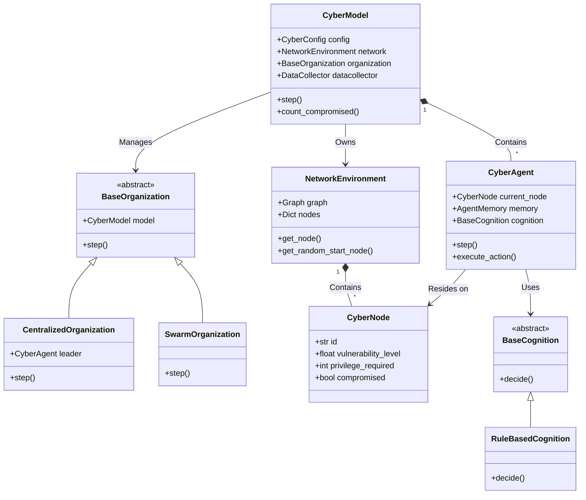

# Architecture

The system is built on top of the Mesa Abm framework, dividing the simulation into logic, environment, and agents.

## Architecture Diagram

Below is a visual representation of how the major components interact with each other.

### Component Roles
- **CyberModel:** The central coordinator. Connects the environment, agents, and data collection.
- **NetworkEnvironment:** The space where agents operate. It encapsulates the NetworkX graph and `CyberNode` instances.
- **BaseOrganization (Swarm/Centralized):** Determines if the agents act independently (swarm) or report to a centralized leader.
- **CyberAgent:** The actors carrying out the cyber attacks. They have a basic execution loop that delegates decision-making to their `cognition` module.
- **BaseCognition (RuleBased):** Separates the "brain" of the agent from the "body". It looks at the agent's memory and proposes an action.
