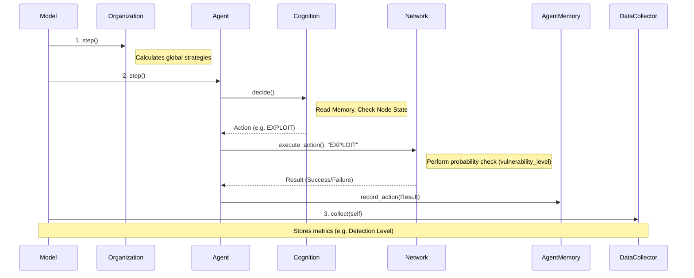

# Data Flow

The flow of data through the abstract cyber simulation dictates how the agents comprehend the attack surface at every step. Because this is an Agent-Based Model, the "data" largely represents moving through physical space and memory updates.

## Simulation Step Sequence

Here is the step-by-step logic of what happens at a given "clock tick" within Mesa:

## Important Pipelines & Transformations
1. **Model Tick:** The `CyberModel` acts as the simulation clock. Its `step()` method sets off the pipeline.
2. **Action Pipeline:**
    - An agent requests an action.
    - Instead of directly editing the graph, the agent queries the `NetworkEnvironment`.
    - If the action is `EXPLOIT`, a probabilistic check against the node's `vulnerability_level` is made.
    - If success: The node is formally tagged as `compromised=True`.
    - If fail: The agent's action throws an event back to the model that increases the `detection_level`.
3. **Observation Pipeline:**
    - The `AgentMemory` is never given the exact state of the world to prevent omniscient attackers.
    - Memory is updated strictly via the returns of specific actions, specifically `SCAN`. `SCAN` informs the agent's memory of the surrounding neighbor node IDs.
